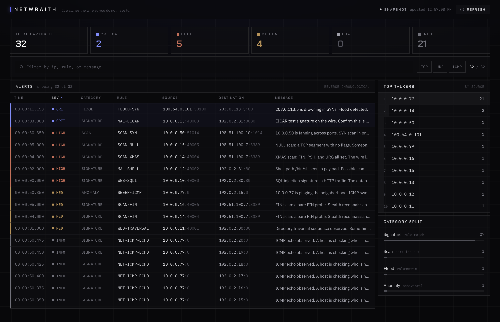

# NETWRAITH

**It watches the wire so you do not have to.**


[](https://github.com/abrar-sarwar/netwraith/actions/workflows/engine-ci.yml)

NETWRAITH is a signature and heuristic based network intrusion detection engine written in C++17 on top of
libpcap, paired with a live, dark mode dashboard built in Next.js. The engine parses traffic from the link layer
up through the transport layer by hand, matches it against a rule file and three stateful heuristics, and emits
structured JSON alerts. A small Node bridge tails those alerts and streams them to the dashboard over WebSocket.
It runs locally, needs no root to demo, and ships with a replayable capture so a reviewer sees it work in seconds.

## What it catches

- Signature matches: HTTP SQL injection, directory traversal, shell strings (`/bin/sh`), and the EICAR test signature.
- TCP scan flavors: NULL scans (no flags), FIN scans, and XMAS scans (FIN, PSH, URG set).
- SYN port scans: one source fanning across many destination ports inside a short window.
- SYN floods: a single destination drowning in SYNs from many sources.
- ICMP sweeps: one source pinging a whole neighborhood of distinct hosts.

## Demo

No root, no live traffic, no cloning required to believe it. This is the literal session from replaying the
committed capture through the engine. The repeated ICMP echo lines from the sweep are trimmed for readability,
and the elisions are marked.

```text
$ ./engine/netwraith -r captures/demo.pcap -o engine/netwraith.jsonl
NETWRAITH: 8 signature rule(s) online.
NETWRAITH: replaying captures/demo.pcap.
NETWRAITH: online. Ctrl-C to stand down.
2025-06-01T00:00:00.000Z  HIGH  signature  SQL injection signature in HTTP traffic. The database is under probe.  10.0.0.10:40000 -> 192.0.2.80:80
2025-06-01T00:00:01.000Z  MEDIUM  signature  Directory traversal sequence observed. Something is walking the filesystem.  10.0.0.11:40001 -> 192.0.2.80:80
2025-06-01T00:00:02.000Z  HIGH  signature  Shell path /bin/sh seen in payload. Possible command execution attempt.  10.0.0.12:40002 -> 192.0.2.81:80
2025-06-01T00:00:03.000Z  CRITICAL  signature  EICAR test signature on the wire. Confirm this is a drill.  10.0.0.13:40003 -> 192.0.2.81:8080
2025-06-01T00:00:04.000Z  MEDIUM  signature  FIN scan: a bare FIN probe. Stealth reconnaissance underway.  10.0.0.14:40004 -> 198.51.100.7:3389
2025-06-01T00:00:04.000Z  HIGH  signature  XMAS scan: FIN, PSH, and URG all set. The wire is being mapped.  10.0.0.14:40004 -> 198.51.100.7:3389
2025-06-01T00:00:05.000Z  HIGH  signature  NULL scan: a TCP segment with no flags. Someone is mapping you quietly.  10.0.0.15:40005 -> 198.51.100.7:3389
2025-06-01T00:00:06.000Z  MEDIUM  signature  FIN scan: a bare FIN probe. Stealth reconnaissance underway.  10.0.0.16:40006 -> 198.51.100.7:3389
2025-06-01T00:00:07.000Z  INFO  signature  ICMP echo observed. A host is checking who is home.  10.0.0.99:0 -> 198.51.100.50:0
2025-06-01T00:00:11.153Z  CRITICAL  flood  203.0.113.5 is drowning in SYNs. Flood detected.  100.64.0.101:50100 -> 203.0.113.5:80
2025-06-01T00:00:30.350Z  HIGH  scan  10.0.0.50 is fanning across ports. SYN scan in progress.  10.0.0.50:51014 -> 198.51.100.10:1014
2025-06-01T00:00:50.000Z  INFO  signature  ICMP echo observed. A host is checking who is home.  10.0.0.77:0 -> 192.0.2.1:0
(14 more ICMP echo signatures as 10.0.0.77 walks 192.0.2.1 through 192.0.2.15, trimmed)
2025-06-01T00:00:50.350Z  MEDIUM  anomaly  10.0.0.77 is pinging the neighborhood. ICMP sweep.  10.0.0.77:0 -> 192.0.2.15:0
(5 more ICMP echo signatures from the same sweep, trimmed)

NETWRAITH: standing down.
  packets seen : 178
  alerts fired : 32
    critical : 2
    high     : 5
    medium   : 4
    low      : 0
    info     : 21
```

Every alert above is also written to `engine/netwraith.jsonl`, one JSON object per line, for the bridge and the
dashboard to consume:

```json
{"ts":1748736011153,"severity":"critical","category":"flood","rule_id":"FLOOD-SYN","msg":"203.0.113.5 is drowning in SYNs. Flood detected.","src":"100.64.0.101:50100","dst":"203.0.113.5:80","proto":"tcp"}
```

### The dashboard

The dashboard is the calm, dark mode operator view: a live alert feed in a console treatment, severity stat cards,
a top talkers panel, and a category breakdown, all updating as alerts arrive over WebSocket.

<!-- Drop a dashboard screenshot or terminal GIF here. Suggested path: docs/dashboard.png -->


## Quickstart

Three steps. The first two need no root.

**1. Build the engine and see alerts immediately.**

```bash
make -C engine
./engine/netwraith -r captures/demo.pcap -o engine/netwraith.jsonl
```

**2. Bring up the full pipeline (engine replay, then the bridge).**

```bash
./scripts/demo.sh
```

**3. Start the dashboard in a second terminal, then open http://localhost:3000.**

```bash
cd dashboard
npm install
npm run dev
```

To watch a live interface instead of a replay, capture needs raw socket access. Grant it once with setcap rather
than running the whole engine as root:

```bash
sudo setcap cap_net_raw,cap_net_admin+eip ./engine/netwraith
./engine/netwraith -i eth0
```

## Architecture

```
engine/        C++17 detection engine: libpcap capture, hand-rolled parsing, rules, and heuristics
  include/     shared types (netwraith.h) and the parser, detector, and emitter interfaces
  src/         parser, detector, emitter, and main (pcap loop, CLI, BPF, signals, threads)
  rules/       default.rules, the signature set in a simple key=value format
bridge/        Node sidecar: tails the JSONL log, serves WebSocket and a small REST API
dashboard/     Next.js 14 dashboard: live feed, severity cards, top talkers, category breakdown
captures/      the scapy generator and the committed demo.pcap
scripts/       demo.sh, the one command runner for the engine to bridge path
.github/       the engine build and replay smoke test that backs the CI badge
```

Data flow: the engine writes JSON Lines to `engine/netwraith.jsonl`, the bridge tails that file and serves the
alerts over WebSocket and REST, and the dashboard renders them live.

## Design notes

A few choices were made on purpose, and they are worth naming.

- The engine runs packet capture on one thread and alert processing on a second, handing alerts across a
  thread safe queue guarded by a mutex and a condition variable. The capture path stays lean and never blocks on a
  slow sink.
- All heuristic state lives inside the Detector class, in member fields keyed by source or destination address.
  There are no function local statics and no globals. The detector owns its windows, which keeps the design clean
  and testable.
- Packet headers are parsed by hand against packed layout structs with bounds checks at every layer, and the JSON
  alerts are serialized by hand with a small correct escaper. There is no parsing or JSON dependency in the engine.
  Writing those correctly is part of the point.
- Heuristic windows are measured against the packet capture timestamp, not wall clock time, so a capture replays
  identically at full speed.

## Roadmap

- Regex and PCRE backed content rules, beyond plain substring matching.
- Rule priorities and suppression, so high value signatures win and noise can be tuned down.
- IPv6 parsing alongside the current IPv4 path.
- GeoIP enrichment on the dashboard, to place talkers on a map.
- Persistent storage for historical queries, so the feed is not the only memory.
- A packaged Docker Compose for one command full stack startup.

## Limitations

NETWRAITH is honest about what it is. It parses IPv4 only, and only TCP, UDP, and ICMP above it. The heuristics use
simple sliding windows with fixed thresholds, not adaptive baselining. It is a learning and demonstration tool that
shows how a detection engine is built, not a hardened production sensor. Treat it as a sharp, readable reference,
not as your last line of defense.

## License

MIT. See [LICENSE](LICENSE).
